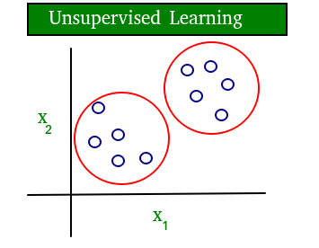
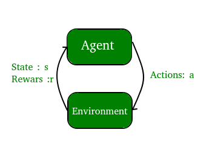
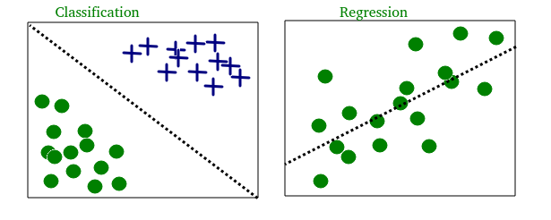
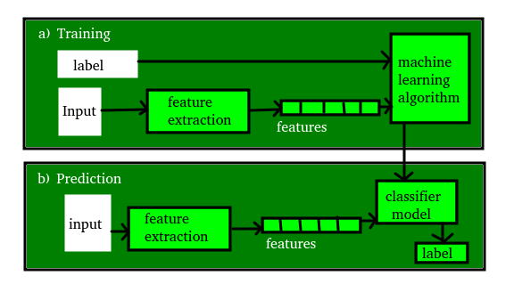

# **🧠 Machine Learning**
Machine Learning is the field of study that gives computers the capability to learn without being explicitly programmed. ML is one of the most exciting technologies that one would have ever come across. As it is evident from the name, it gives the computer that which makes it more similar to humans: The ability to learn. Machine learning is actively being used today, perhaps in many more places than one would expect.

***

## **📚 Types of machine learning**
There are various ways to classify machine learning problems. Here, we discuss the most obvious ones.

1. **Supervised learning**

2. **Unsupervised learning**

3. **Reinforcement learning**

4. **Classification**

5. **Regression**

***

## **🚀 Quick Discussion**
Let's discuss all the ways by which we do machine learning

### **1. 🧐 Supervised Learning**
 The computer is presented with example inputs and their desired outputs, given by a “teacher”, and the goal is to learn a general rule that maps inputs to outputs. The training process continues until the model achieves the desired level of accuracy on the training data.

 #### **Used Cases**
 - **Image Classification :** *You train with images/labels. Then in the future you give a new image expecting that the computer will recognize the new object.*

 - **Market Prediction/Regression :** *You train the computer with historical market data and ask the computer to predict the new price in the future.*

### **2. 🤹 Unsupervised Learning**
No labels are given to the learning algorithm, leaving it on its own to find structure in its input. It is used for clustering population in different groups. Unsupervised learning can be a goal in itself (discovering hidden patterns in data).

#### **Includes**
- **Clustering :** *You train with images/labels. Then in the future you give a new image expecting that the computer will recognize the new object.*

- **High Dimension Visualization :** *Use the computer to help us visualize high dimension data.*

- **Generative Models :** *After a model captures the probability distribution of your input data, it will be able to generate more data. This can be very useful to make your classifier more robust.*

A diagram which clears the concept of supervised and unsupervised learning
--
 | 
------------------- | ---------------------
The data in supervised learning is labelled & distinguishes data points as **[O]** & **[X]** | The data in supervised learning is not labelled as all the data points are labeled **[O]**

### **3. 🏆 Reinforcement learning**
A computer program interacts with a dynamic environment in which it must perform a certain goal (such as driving a vehicle or playing a game against an opponent). The program is provided feedback in terms of rewards and punishments as it navigates its problem space.

Diagram of reinforcement Learning
--

### **4. 📊 Classification**
Inputs are divided into two or more classes, and the learner must produce a model that assigns unseen inputs to one or more (multi-label classification) of these classes. This is typically tackled in a supervised way. Spam filtering is an example of classification, where the inputs are email (or other) messages and the classes are “spam” and “not spam”.

### **5. 📈 Regression**
It is also a supervised learning problem, but the outputs are continuous rather than discrete. For example, predicting the stock prices using historical data.

 Classification and regression on two different datasets
--
  

### **6. Clustering**
Here, a set of inputs is to be divided into groups. Unlike in classification, the groups are not known beforehand, making this typically an unsupervised task.
As you can see in the example below, the given dataset points have been divided into groups identifiable by the colors red, green and blue.

Diagram with 3 clusters
--

***

## **💤 Terminologies of Machine Learning**

Terminology is the key to understand Machine Learning. Here are few most commonly used terms in Machine Learning.

Term | Defination
-----|-----------
**Model** | A model is a specific representation learned from data by applying some machine learning algorithm. A model is also called hypothesis.
**Feature** | A feature is an individual measurable property of our data. A set of numeric features can be conveniently described by a feature vector. Feature vectors are fed as input to the model. For example, in order to predict a fruit, there may be features like color, smell, taste, etc.
**Target (Label)** | The idea is to give a set of inputs(features) and it’s expected outputs(labels), so after training, we will have a model (hypothesis) that will then map new data to one of the categories trained on.
**Prediction** | Once our model is ready, it can be fed a set of inputs to which it will provide a predicted output(label).

Complete flow of Machine Learning
--

***
## **❤ Support**
Collecting resources, working and making them easy to understand so that you enjoy learning is not an easy task

*Please support the work:*
 - [Follow on **Github**](https://github.com/amannirala13)
 - [Follow on **LinkedIn**](https://www.linkedin.com/in/amannirala13/)
 - [Follow on **Twitter**](https://twitter.com/AmanNirala13)
 - [Follow on **Instagram**](https://www.instagram.com/amannirala13/)
 - [Follow on **HackerRank**](https://www.hackerrank.com/amannirala13)

[~~Info Source®~~](https://www.geeksforgeeks.org/getting-started-machine-learning/)
